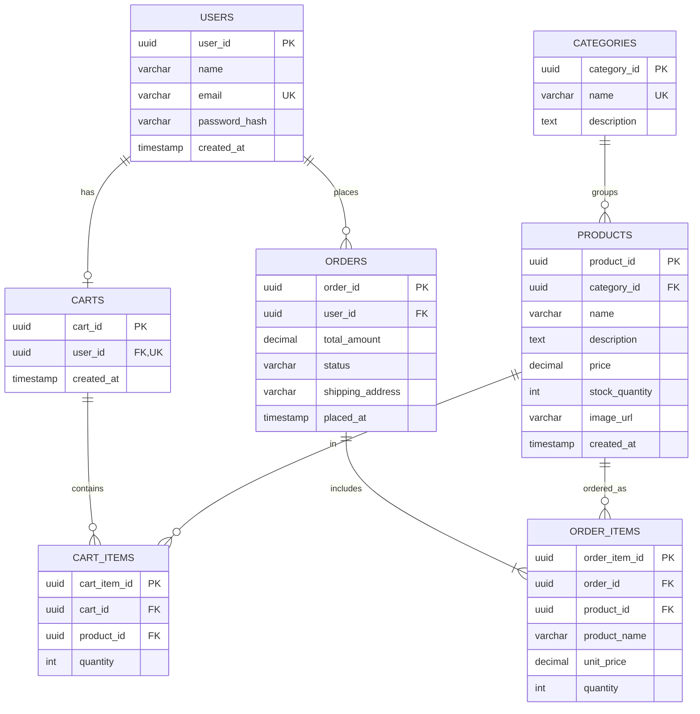

# Sprint 1: Architecture & Scope Definition

## 1. Target Audience & Market Focus

**User Persona**

The target user is someone like Sara Ahmed, a 21-year-old university student who shops online mostly from her phone. She's price-conscious, doesn't like scrolling through cluttered websites, and wants to quickly find an item, check if it's in stock, and order it without creating an account for every small purchase (though she's fine signing up if it means she can track her past orders).

**Core Problem**

Most small clothing/accessories sellers in this space either sell through Instagram DMs or WhatsApp, which means no proper catalog, no real cart, and customers have to manually ask "is this in stock?" every time. This project solves that by giving customers an actual website where they can browse, add to cart, and checkout on their own — no back-and-forth messaging needed.

**Market Vertical**

The store will focus on **affordable fashion and accessories** (clothes, bags, footwear type items). This vertical was picked because:
- Products naturally fall into categories (easy to organize)
- Each product needs pretty much the same info: name, price, image, stock, description
- It's a simple, well-understood browse → cart → order flow, good for an MVP

**What's assumed for now (out of scope):**
- Single store, single currency, no multi-vendor
- Admin manually manages stock/inventory
- Orders get recorded in the system, but actual online payment gateway isn't part of MVP — customer info/order is captured, payment can be added in a later sprint
- Browsing is open to everyone, but you need an account to actually place an order and see order history

## 2. MVP Feature Scope

| Category | Feature | Description | Priority |
|---|---|---|---|
| Catalog | Browse products | Show all products in a grid with image, name, price, and whether it's in stock | Must Have |
| Catalog | Category filter | Let user click a category (e.g. "Shoes", "Bags") and see only products from that category | Must Have |
| Catalog | Product detail page | Clicking a product opens a page with full description, price, stock, and category | Must Have |
| Account | Signup / Login | User can create an account and log back in so their cart/orders are tied to them | Must Have |
| Cart | Add/remove/update cart | Add product to cart, change quantity, remove item, see running total | Must Have |
| Orders | Checkout + order history | User enters delivery details, places the order, gets confirmation, and can view past orders later | Must Have |

**Not doing in this sprint (deferred):** payments integration, reviews/ratings, coupons/discounts, wishlist, recommendations, multi-seller support, analytics dashboard, live order tracking. These are all "nice to have later" but would make the MVP too big to actually finish right now.

## 3. Tech Stack Selection & Justification

| Layer | Choice | Why |
|---|---|---|
| Frontend | React (with TypeScript) | Component-based, so catalog/cart/checkout pages can be built and reused easily. TypeScript catches type mistakes early, which matters since this project grows over 6 sprints. |
| Styling | Tailwind CSS | Faster to style directly in components instead of writing separate CSS files, and keeps things responsive for mobile since most users will be on phones. |
| Backend | Node.js + Express (TypeScript) | Simple to set up REST APIs solo, good community support, and keeping TypeScript on both ends means the data types match up between frontend and backend. |
| Database | PostgreSQL | Relational data (users, products, orders, order items) fits naturally into tables with foreign keys. Also handles transactions properly, which matters for checkout (don't want stock going negative). |
| ORM | Prisma | Makes writing DB queries less error-prone, handles migrations, and gives a visual schema which helps since I'm working alone and need to keep track of the structure. |
| Auth | Sessions + hashed passwords | Keeps auth logic on the server, passwords never stored in plain text, and lets each user have their own cart/order history. |
| Caching (optional) | Redis | Not required for MVP since traffic will be low, but noted as an option later for caching category/product data if the app needs to scale. |
| Hosting | Render / Railway (or similar free-tier host) with managed PostgreSQL | Easy to deploy a Node + Postgres app without managing servers manually, gives a live URL to share for grading. |

**Basic structure:**

```
React + TypeScript (frontend)
        |
   REST API (JSON over HTTPS)
        |
Node.js + Express (backend)
        |
      Prisma
        |
   PostgreSQL (database)
```

Frontend never talks to the database directly — everything (auth, stock checks, order creation) goes through the backend API.

## 4. Entity-Relationship Diagram (ERD)

Covers Users, Products, Categories, Orders, Order_Items, Carts, and Cart_Items.



**Notes on relationships:**

- One **user** → zero or one **cart** (each cart belongs to exactly one user)
- One **user** → zero or many **orders**
- One **category** → zero or many **products**
- One **cart** → zero or many **cart items**; each cart item points to one product
- One **order** → one or more **order items** (an order can't exist with zero items); each order item points to one product
- `order_items` stores its own copy of `product_name` and `unit_price` — this is so that if the product's price changes later, old orders still show what was actually paid at the time
- `email` in USERS and `name` in CATEGORIES should be unique
- Ideally, `cart_id + product_id` should be unique in CART_ITEMS so the same product doesn't show up as two separate rows in one cart
- Placing an order (checking stock, creating order + order items, reducing stock, clearing cart) should happen as a single transaction so nothing gets left in a broken state if something fails halfway
